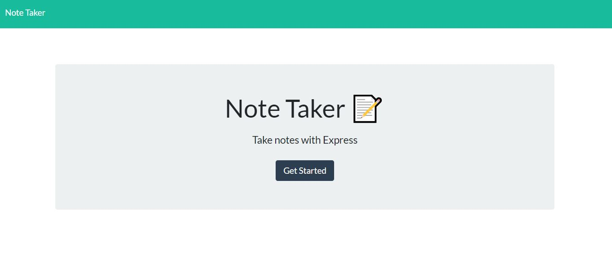

# Note-Taker 

## Description
AS A user, I want to be able to write and save notes
I WANT to be able to delete notes I've written before
SO THAT I can organize my thoughts and keep track of tasks I need to complete

## Table of Contents
- [Description](#description)
- [Deployment](#deploy)
- [How to Use](#usage)
- [Questions](#questions)

## DEPLOYMENT on HEROKU
Visit the website:
[Webpage Link](https://dashboard.heroku.com/apps/lit-sea-88683)

## HOW TO USE 
NPM INIT -y
NPM I EXPRESS 

## Questions?
- contact: kmsaunders7@gmail.com
- GITHUB: kmsaunders7